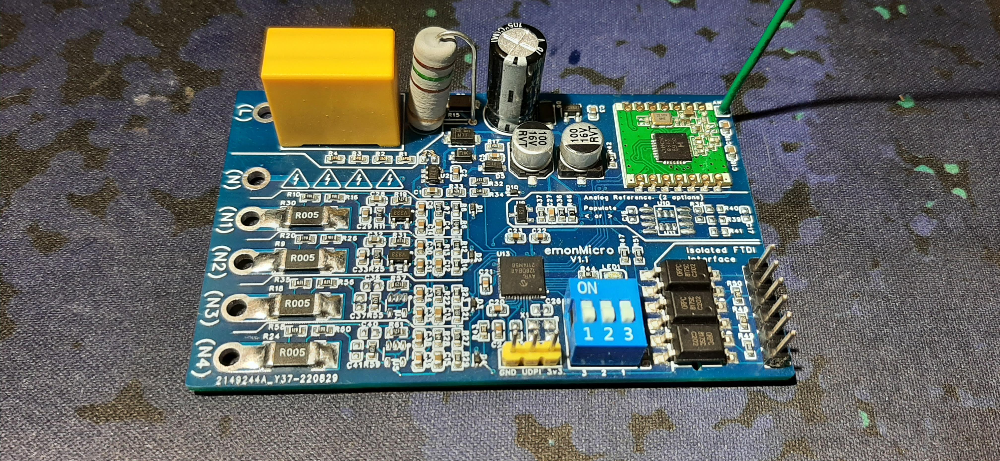
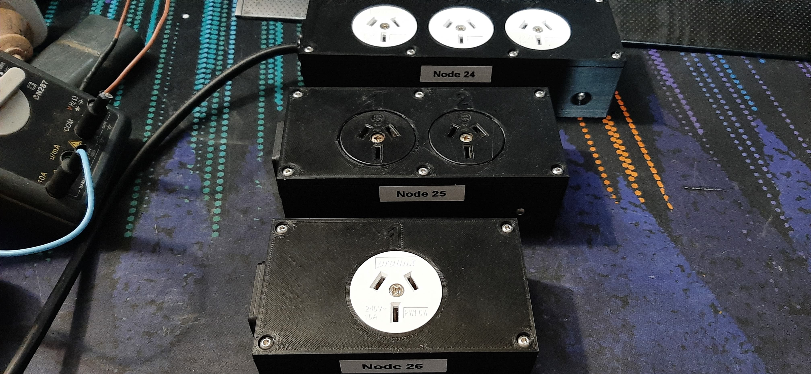

# EmonMicro

This is a small self-contained energy monitoring device designed to work with [Open Energy Monitor](https://openenergymonitor.org/)

I recently installed an open energy monitor EmonTx v4 so that I could monitor the power usage of that various circuits in my house. 
but I found myself wanting more information. The tx v4 can for example tell me how much power is being used by the bedroom circuit,
but it can't tell me how much power is going to each room or appliance. This project was started as a solution.

## Disclaimer!
I am not a qualified electrical engineer! I am just a hobbyist who occasionally likes to design and build things.
I am releasing this design so that others may learn from it and possibly improve on it.
If you choose to build this device you do so at your own risk! If it happens to burst into flames, or you
electrocute yourself because you're not qualified to work on mains-powered devices I can not be held responsible.

### The design
The idea behind this project was to build an energy monitor in a form factor similar to a standard power strip.
The board supports up to four separate channels, but I found the most I personally need was three and in most cases i only need one.
Unused channels can simply be left unpopulated.

For the sockets I used [PW1-0W](https://www.wagneronline.com.au/ac-power-installation/power-240vac/power-lighting/pw1-0w-35241/973869/pd/) panel mount sockets.  
As well as a couple sockets I pulled out of an old UPS.

For the power input I decided to go with 10A fused IEC ports. I chose these because both the ports and the plugs are rated at 10 amps
and you can get them with built-in fuses, so they seemed like a convenient solution. 
**Turns out this was a mistake...** I later discovered that although the plugs are rated for 10 amps
the vast majority of IEC cables use 0.75mm2 conductors which are only rated for around 7 amps.
So to work around this I have to forgo the fuse and hard-wire suitable cords for use cases that require more than 7 amp capacity.

### Safety and Isolation
Unlike all other OEM devices this design has no isolation between mains and the low voltage electronics.
By eliminating the bulky isolation components and switching to a transformerless power supply I was able to make
the board very compact and reduce component cost. The downside is this means the low voltage electronics are referenced to mains so the entire board
must be fully enclosed in a proper safe enclosure when the device is powered.
This is fine in normal operation but the device still needs to be connected to a computer while powered in order to be calibrated.
The solution I came up with was to add an optically isolated FTDI port that can be safely connected to an FTDI adapter. 

This also means you can't use an external antenna but with a plastic enclosure and internal antenna glued around the perimeter of the box 
seems to provide pretty good range.  

### The power supply and use with 110v power
The only thing stopping this from working with 110v is the value of the capacitor in the transformerless power supply.
I ran some basic simulations to get a rough idea of the value I needed but the monitor does not use a consistent amount of current.
Instead, mostly just sips power until it needs to transmit at which point the TX module pules up to 45ma in short bursts.
Through a bit of trial and error I found that a 680nf input cap with 1000uf buffer cap charged to 9v can more than 
handle the power demands of normal operation. 
on a 110v supply you could theoretically just double value of the input capacitor. Though that would require some testing to be sure.  

### Future plans? 
As of writing this I don't have any immediate plans to continue working on this project.
But its possible I may re visit this project in the future. 
